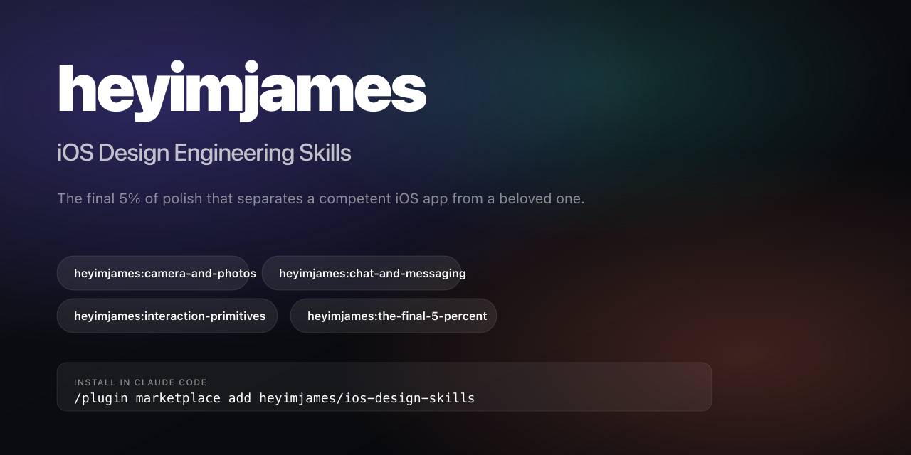

<p align="center">
  
</p>

# iOS Design Engineering Skills

Four detailed, opinionated design-engineering skills for building **best-in-class native iOS/SwiftUI apps** — installable into Claude Code, Cursor, Codex CLI, Windsurf, Aider, Continue, and Zed.

> "Whoever made this actually gives a shit."
> That's the only goal.

> **Looking for cross-platform skills?** OG image design lives in a sibling marketplace: [heyimjames/design-engineering-skills](https://github.com/heyimjames/design-engineering-skills).

---

## What's in here

| Skill | What it covers | Lines |
| --- | --- | --- |
| [**Camera & Photos**](plugins/heyimjames/skills/camera-and-photos/SKILL.md) | Capture UX, viewfinder, editing flows, library, AI photo features, AVFoundation / PhotoKit / Vision / LiDAR / Cinematic / ProRAW / Camera Control button | ~668 |
| [**Chat & Messaging**](plugins/heyimjames/skills/chat-and-messaging/SKILL.md) | Bubble grouping, composer, reactions, voice messages, typing/presence, encryption, CallKit / PushKit / Live Activities / NSE / Communication Notifications | ~881 |
| [**Interaction Primitives**](plugins/heyimjames/skills/interaction-primitives/SKILL.md) | Home / Lock / StandBy widgets, Live Activities, Dynamic Island, Haptic Touch, `.sensoryFeedback`, Core Haptics, Action Button, Symbol Effects, Focus filters, Liquid Glass | ~1127 |
| [**The Final 5%**](plugins/heyimjames/skills/the-final-5-percent/SKILL.md) | Motion physics, hero transitions, typography, color hierarchy, spacing rhythm, loading/empty states, microcopy, accessibility-as-polish, iOS 26 Liquid Glass | ~1959 |

Each skill is **opinionated and specific** — exact spring damping ratios, exact corner radii, exact haptic styles, exact font sizes. The kind of detail that separates a competent app from a beloved one.

---

## Install

Pick your tool. One command, one place.

> First-time: `chmod +x install.sh build.sh` (the script will tell you if you forgot).

### Claude Code (via plugin marketplace — recommended)

In any Claude Code session:

```
/plugin marketplace add heyimjames/ios-design-skills
/plugin install heyimjames@heyimjames
```

After install, the four skills are namespace-prefixed under your brand:

```
heyimjames:camera-and-photos
heyimjames:chat-and-messaging
heyimjames:interaction-primitives
heyimjames:the-final-5-percent
```

Every invocation requires typing `heyimjames:` — branding by design. Claude Code auto-invokes each skill based on the `Triggers on:` keyword list in its description, so you rarely have to type the name yourself in conversational use.

For LOCAL development (so edits to your local clone are picked up by Claude Code without re-pushing to GitHub):

```
/plugin marketplace add /path/to/this/repo
/plugin install heyimjames@heyimjames
```

To uninstall:

```
/plugin uninstall heyimjames@heyimjames
/plugin marketplace remove heyimjames
```

### Cursor

```bash
./install.sh cursor              # project-level: .cursor/rules/
./install.sh cursor --global     # user-level: ~/.cursor/rules/
```
Generates `.mdc` rule files with file globs so each skill auto-attaches when relevant Swift files are open. Camera skill activates on `Camera*.swift` / `Photo*.swift` / `AV*.swift`; chat skill on `Message*.swift` / `Chat*.swift`; etc. The polish skill applies to all Swift files.

### Codex CLI (OpenAI)

```bash
./install.sh codex               # project: appends to ./AGENTS.md
./install.sh codex --global      # user: appends to ~/.codex/AGENTS.md
```
Wraps the four skills in marker comments (`<!-- BEGIN ios-design-skills -->`) so re-running install/uninstall updates cleanly.

### Windsurf

```bash
./install.sh windsurf
```
Drops `.windsurfrules` into the current project.

### Aider

```bash
./install.sh aider
```
Drops `CONVENTIONS.md` into the current project. Add `read: CONVENTIONS.md` to your `.aider.conf.yml` to pin it.

### Continue

```bash
./install.sh continue              # project: .continue/rules/
./install.sh continue --global     # user: ~/.continue/rules/
```

### Zed

```bash
./install.sh zed
```
Drops the four skills into `.rules/` in the current project.

### Uninstall any tool

```bash
./install.sh <tool> uninstall
```

---

## How auto-invocation works in each tool

| Tool | Mechanism | Configured by |
| --- | --- | --- |
| **Claude Code** | Description-based — the model matches the user's prompt against each skill's `description` + trigger keywords. Plugin namespacing prefixes every skill name with `heyimjames:` | Already baked into the canonical `SKILL.md` frontmatter + `plugins/heyimjames/.claude-plugin/plugin.json` |
| **Cursor** | File globs — rule auto-attaches when matching files are in context | `globs:` injected by the build script |
| **Codex / Aider / Windsurf** | Always-loaded — present in every prompt of the project | Just install once per project |
| **Continue** | Description-based + `.md` file frontmatter | Injected by the build script |
| **Zed** | Always-loaded if `.rules/` exists | Just install once per project |

No changes are needed to the canonical `SKILL.md` files — the build script injects tool-specific invocation hints.

---

## Updating

```bash
git pull
./build.sh all          # regenerate dist/ from skills/
./install.sh <tool>     # reinstall (idempotent — re-overwrites)
```

If you edit anything in `skills/*/SKILL.md`, run `./build.sh` before committing so the `dist/` variants stay in sync.

---

## Repo layout

```
ios-design-skills/                            ← marketplace root
├── README.md
├── LICENSE                                   ← MIT
├── .claude-plugin/
│   └── marketplace.json                      ← Claude Code marketplace catalog
├── plugins/
│   └── heyimjames/                           ← the plugin (name = invocation prefix)
│       ├── .claude-plugin/
│       │   └── plugin.json                   ← plugin manifest
│       └── skills/                           ← canonical source (Claude Code native)
│           ├── camera-and-photos/SKILL.md
│           ├── chat-and-messaging/SKILL.md
│           ├── interaction-primitives/SKILL.md
│           └── the-final-5-percent/SKILL.md
├── install.sh                                ← per-tool installer for non-Claude tools
├── build.sh                                  ← regenerates dist/ from canonical source
├── scripts/
│   └── build.py                              ← Python build logic (stdlib only)
└── dist/                                     ← auto-generated per-tool variants
    ├── cursor/.cursor/rules/*.mdc
    ├── codex/AGENTS.md
    ├── aider/CONVENTIONS.md
    ├── windsurf/.windsurfrules
    ├── continue/.continue/rules/*.md
    └── zed/.rules/*.md
```

---

## Philosophy

These skills aren't checklists. They're opinions, encoded as practical patterns:

1. **Glanceability is the entire design constraint.** A widget gets 0.5 seconds. The Dynamic Island gets less. Design for the half-second.
2. **One App Intent, many surfaces.** Since iOS 17, the same `AppIntent` powers Home widgets, Lock widgets, StandBy, Control Center, Action Button, and Siri. Architect once, surface six places.
3. **Polish everything equally.** Settings page = hero page = empty state = error screen. The "dirty bathroom" rule: one neglected corner cheapens the whole.
4. **Simultaneous motion reads as mechanical; sequential reads as organic.** Stagger by 30–80ms.
5. **The user shouldn't NOTICE polish — they should FEEL it.** They can't articulate why your app feels different. They just know.

Reference apps studied in the writing: Halide, Kino, Lapse, Locket, (Not Boring) Camera, VSCO, Apple Photos, iMessage, Telegram, WhatsApp, Snapchat, Instagram, Discord, Things 3, Linear, Family, Granola, Flighty, Moonlitt, Sunlitt, Apple Music, Apple Fitness.

Reference reading: [Rauno Freiberg — Invisible Details of Interaction Design](https://every.to/p/invisible-details-of-interaction-design), [Karri Saarinen's 10 Rules](https://www.figma.com/blog/karri-saarinens-10-rules-for-crafting-products-that-stand-out/), [The Linear Method](https://linear.app/method), [Family Values by Benji Taylor](https://benji.org/family-values), [Apple HIG](https://developer.apple.com/design/human-interface-guidelines/), [Donny Wals — Liquid Glass on iOS 26](https://www.donnywals.com/designing-custom-ui-with-liquid-glass-on-ios-26/).

---

## Status

🔒 **Private repo for now.** Currently distributed by direct git clone among James + collaborators.

**Public plan** (eventually):
- Flip repo to public.
- Submit to Claude Code's plugin marketplace.
- Add a small landing page.
- `brew tap` for Homebrew install.
- Contribution guidelines.

---

## License

MIT — see [LICENSE](LICENSE). Use them, fork them, ship apps with them.

---

Made by [James Frewin](https://jamesfrewin.com) of [October](https://octoberwip.com), a design studio · [@james_frewin](https://x.com/james_frewin) · [LinkedIn](https://linkedin.com/in/jamesfrewin)
